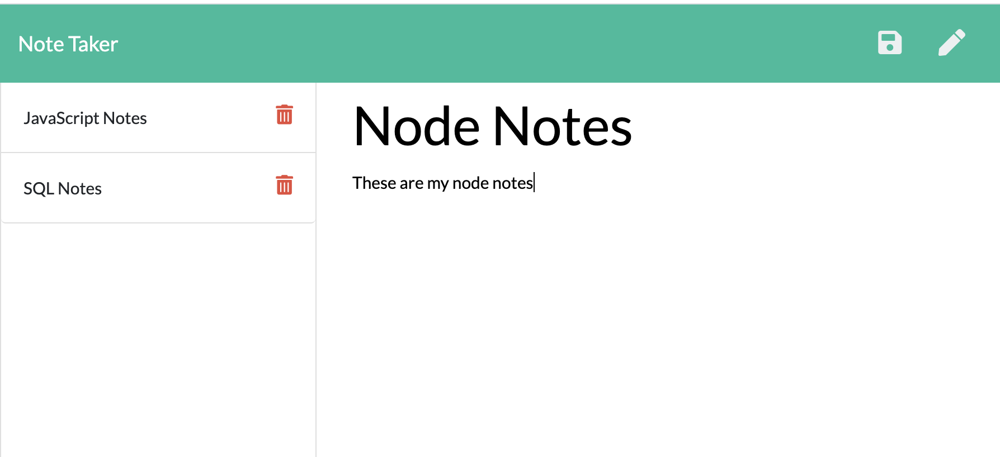

# Note taker app

## Description

This app can be used to write, save, and delete notes. This application also uses an express backend and saves and retrieves note data from a JSON file. This app is deployed on Heroku. 

**[Video of working application](https://youtu.be/whfQ-iJw_AY)**

**[Heroku Link for Deployed App](https://idallas-note-taker-app.herokuapp.com/)**

## Index/ home page

## Note page

## Note with notes

## User Story

With this app the user is able to write and save notes

The user is also able delete notes that they wrote before

So the user can organize their thoughts and keep track of tasks

